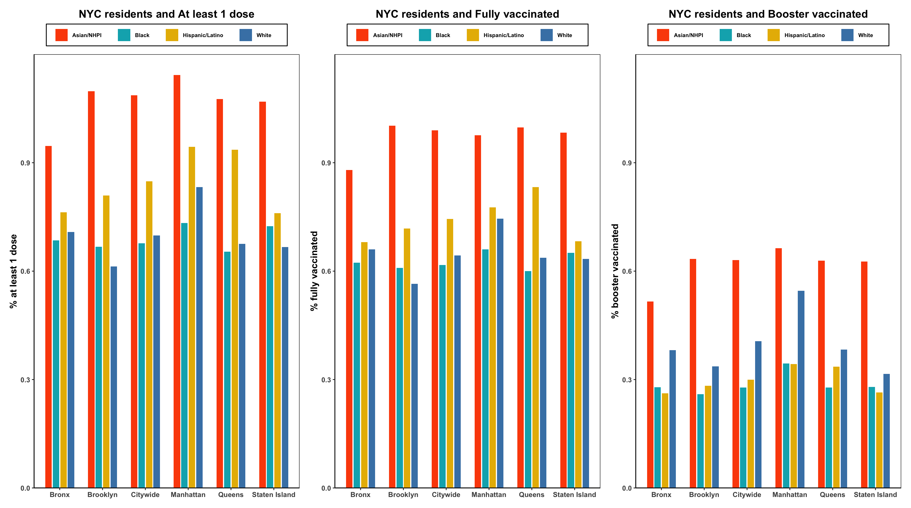
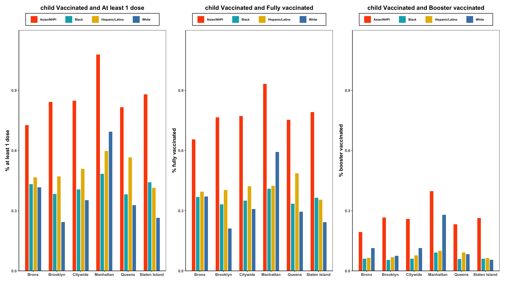
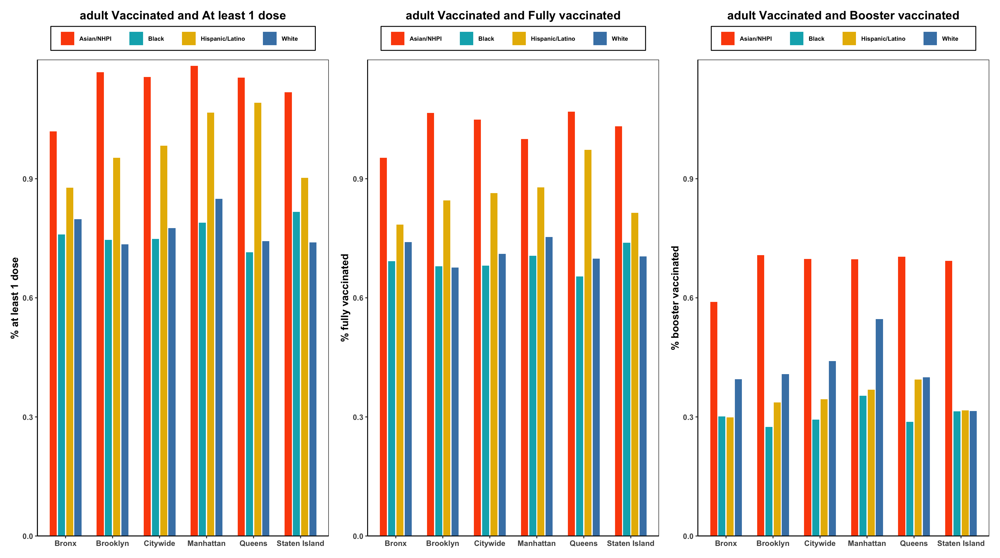
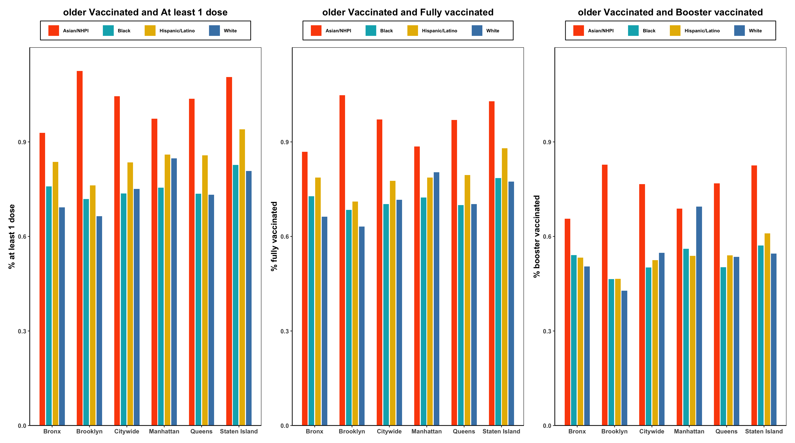
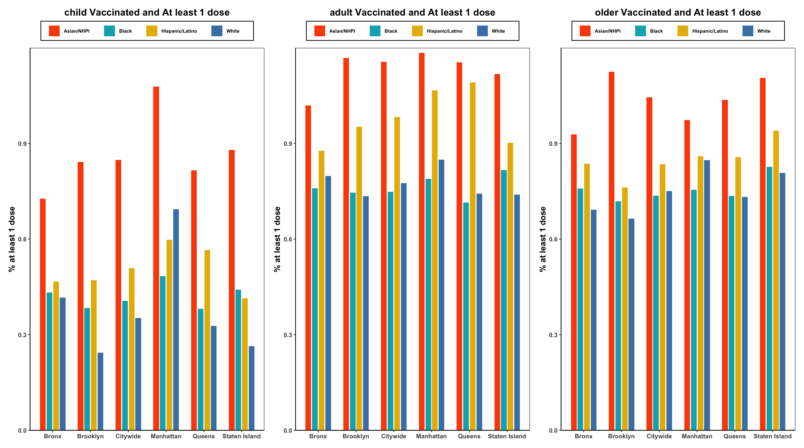
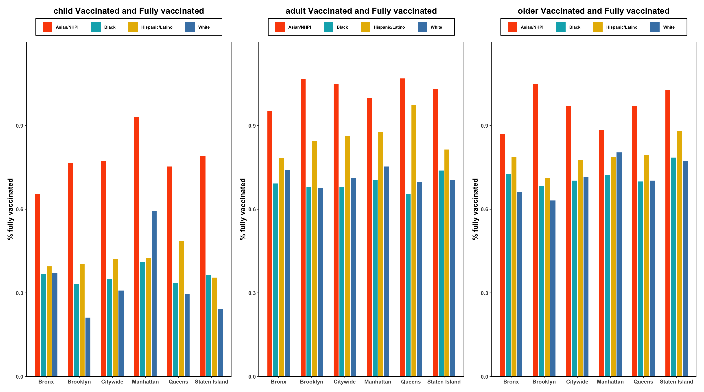
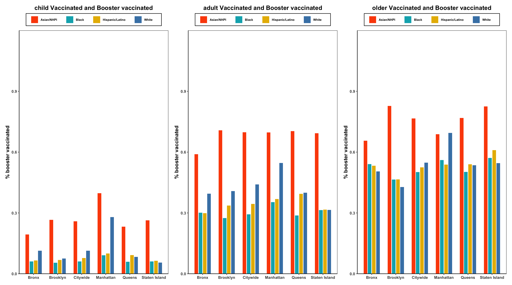

---
output:
  html_document: default
  pdf_document: default
---

# Results

## Residents Vaccinated

In this part, we want to explore whether there is a relationship between vaccinated people's residency, age and race. The data we use is loaded from `by-residency-demo.csv`.

The following mosaic chart show the residency and age of NYC residents who are vaccinated for COVID-19. We can the proportion of children who were vaccinated was higher among New Yorkers than among non-New Yorkers and the proportion of adult who were vaccinated was lower among New Yorkers than among non-New Yorkers.

```{r echo=FALSE}
library(vcd)
library(grid)
library(patchwork)
library(ggplot2)
library(dplyr)
library(reshape2)

residency_vacc <- read.csv("./data/by-residency-demo.csv", sep = ',', header = T)
residency_vacc[residency_vacc=='Unknown'] <- NA #Unknown
residency_vacc[residency_vacc=='UNKNOWN'] <- NA #UNKNOWN
residency_vacc[residency_vacc=='Other'] <- NA #Other
residency_vacc[residency_vacc=='All ages'] <- NA #Other
residency_vacc[residency_vacc=='Native American/Alaska Native'] <- NA
residency_vacc[residency_vacc=='Native Hawaiian/Pacific Islander'] <- NA	
residency_vacc[residency_vacc=='Multiracial'] <- NA
residency_vacc=na.omit(residency_vacc)
df <- data.frame(residency_vacc[,-1])
df[4]=as.numeric(unlist(df[4]))

table1<-xtabs(COUNT_1PLUS_CUMULATIVE ~RESIDENCY+AGE_GROUP, df)
p1 <- mosaic( ~RESIDENCY+AGE_GROUP, table1, shade=TRUE, legend=TRUE, color=TRUE, gp_varnames = gpar(fontsize = 12, fontface = 1), gp_labels = gpar(fontsize = 7))
```

The following mosaic chart show the residency and age of NYC residents who are vaccinated for COVID-19. We can conclude that among black populations, middle-aged adults are less likely to be vaccinated than children and the elderly; whereas in the Asian and Latinos group, compared with children and the elderly, the willingness to vaccinate is stronger among the middle-aged。

```{r echo=FALSE}
table2<-xtabs(COUNT_1PLUS_CUMULATIVE ~AGE_GROUP+RACE_ETHNICITY, df)
p2 <- mosaic( ~AGE_GROUP+RACE_ETHNICITY, table2, shade=TRUE, legend=TRUE, color=TRUE, gp_varnames = gpar(fontsize = 12, fontface = 1), gp_labels = gpar(fontsize = 7))
```

The following mosaic chart show the residency and age of NYC residents who are vaccinated for COVID-19. We can see that Asians, blacks and Latinos living in New York are more open to vaccinations than those who are non-residents

```{r echo=FALSE}
table3<-xtabs(COUNT_1PLUS_CUMULATIVE ~RESIDENCY+RACE_ETHNICITY, df)
p3 <- mosaic( ~RESIDENCY+RACE_ETHNICITY, table3, shade=TRUE, legend=TRUE, color=TRUE, gp_varnames = gpar(fontsize = 12, fontface = 1), gp_labels = gpar(fontsize = 7))
```

## People Vaccinated and Doses Administered by age and borough and race

In this part, we wanted to explore attitudes towards vaccination in different age group and in different boroughs and in different races. The vaccination status is divided into three categories: at least 1 dose; Fully vaccinated(completed the first stage); Booster vaccinated.

Firstly, we focus on all age group. The following bar chart shows that more than sixty percent of the population has been vaccinated, which means that most people in New York are open to vaccines. Among all ethnic groups, Asians have the highest vaccination rate and it is much higher than that of other races; among all boroughs in New York, the Manhattan area has the highest vaccination rate, especially Latinos and whites in this area.



Secondly, we divided age in to three groups: child(0-17); adult(18-64); older(65+). The following 3\*3 bar chart shows the proportion of population in each age group by vaccination status. We can still see that Asians have the highest vaccination rate and it is much higher than any other group.

The vaccination rate of children is much lower than that of adults and the elderly, especially for booster vaccinations. It may be because parents are worried that the booster will have hidden dangers to children's health.







Third, We fixed vaccination status and studied differences across age groups and races and boroughs.

The following three chart show that adults and elderly have higher vaccination coverage than minors of the same ethnicity in the same area, and most adults, elderly,and Asian children have completed all vaccinations. But we observed that, except for booster, the vaccination rate of Asian children is even higher than that of non-Asian adults in the same area. Therefore, we can conclude that Asians trust vaccines much higher than all other races.







```{r echo=FALSE}
library(patchwork)
library(ggplot2)
library(dplyr)

theme_bar <- function(..., bg='white'){
  require(grid)
  theme_classic(...) +
    theme(rect=element_rect(fill=bg),
          plot.margin=unit(rep(0.5,4), 'lines'),
          panel.background=element_rect(fill='transparent', color='black'),
          panel.border=element_rect(fill='transparent', color='transparent'),
          panel.grid=element_blank(),
          plot.title = element_text(face = "bold",size = 14, hjust = 0.5),
          axis.title.x = element_blank(),
          axis.title.y=element_text(face = "bold",size = 12),
          axis.text = element_text(face = "bold",size = 9),
          legend.title=element_blank(),
          legend.position='top',
          legend.direction = "horizontal",
          legend.text = element_text(face = "bold",size = 7,margin = margin(r=15)),
          legend.background = element_rect( linetype="solid",colour ="black")
    )
}

boro_vacc <- read.csv("./data/coverage-by-boro-demo.csv", sep = ',', header = T)
df2 <- data.frame(boro_vacc[,-1])
for (i in c(4:12)) { # change chr to numeric
  df2[i]=as.numeric(unlist(df2[i]))
}
df2_allage <-df2[df2$AGE_GROUP == "All ages",]

df2_child <-df2[df2$AGE_GROUP %in% c('\'0-4', '\'5-12', '\'13-17'), ]
df2_child <- data.frame(df2_child[,-2])
df2_child <- aggregate(cbind(COUNT_1PLUS_CUMULATIVE, COUNT_FULLY_CUMULATIVE, COUNT_ADDITIONAL_CUMULATIVE, POP_DENOMINATOR) ~ BOROUGH + RACE_ETHNICITY, data = df2_child, sum)
q1_1<-ggplot(data=df2_child, mapping=aes(x = BOROUGH, y = COUNT_1PLUS_CUMULATIVE/POP_DENOMINATOR,fill = RACE_ETHNICITY))+
  geom_bar(stat="identity", position=position_dodge(0.7), width=0.6)+
  coord_cartesian(ylim=c(0,1.2))+
  scale_y_continuous(expand = c(0, 0))+
  scale_fill_manual(values =c("#FC4E07","#00AFBB", "#E7B800","#4682B4" ))+
  theme_bar()+
  ylab("% at least 1 dose") + ggtitle("child Vaccinated and At least 1 dose")

q1_2<-ggplot(data=df2_child, mapping=aes(x = BOROUGH, y = COUNT_FULLY_CUMULATIVE/POP_DENOMINATOR,fill = RACE_ETHNICITY))+
  geom_bar(stat="identity", position=position_dodge(0.7), width=0.6)+
  coord_cartesian(ylim=c(0,1.2))+
  scale_y_continuous(expand = c(0, 0))+
  scale_fill_manual(values =c("#FC4E07","#00AFBB", "#E7B800","#4682B4" ))+
  theme_bar()+
  ylab("% fully vaccinated") + ggtitle("child Vaccinated and Fully vaccinated")

q1_3<-ggplot(data=df2_child, mapping=aes(x = BOROUGH, y = COUNT_ADDITIONAL_CUMULATIVE/POP_DENOMINATOR,fill = RACE_ETHNICITY))+
  geom_bar(stat="identity", position=position_dodge(0.7), width=0.6)+
  coord_cartesian(ylim=c(0,1.2))+
  scale_y_continuous(expand = c(0, 0))+
  scale_fill_manual(values =c("#FC4E07","#00AFBB", "#E7B800","#4682B4" ))+
  theme_bar()+
  ylab("% booster vaccinated") + ggtitle("child Vaccinated and Booster vaccinated")


df2_adult <-df2[df2$AGE_GROUP %in% c('\'18-44', '\'45-64'), ]
df2_adult <- data.frame(df2_adult[,-2])
df2_adult <- aggregate(cbind(COUNT_1PLUS_CUMULATIVE, COUNT_FULLY_CUMULATIVE, COUNT_ADDITIONAL_CUMULATIVE, POP_DENOMINATOR) ~ BOROUGH + RACE_ETHNICITY, data = df2_adult, sum)
q2_1<-ggplot(data=df2_adult, mapping=aes(x = BOROUGH, y = COUNT_1PLUS_CUMULATIVE/POP_DENOMINATOR,fill = RACE_ETHNICITY))+
  geom_bar(stat="identity", position=position_dodge(0.7), width=0.6)+
  coord_cartesian(ylim=c(0,1.2))+
  scale_y_continuous(expand = c(0, 0))+
  scale_fill_manual(values =c("#FC4E07","#00AFBB", "#E7B800","#4682B4" ))+
  theme_bar()+
  ylab("% at least 1 dose") + ggtitle("adult Vaccinated and At least 1 dose")

q2_2<-ggplot(data=df2_adult, mapping=aes(x = BOROUGH, y = COUNT_FULLY_CUMULATIVE/POP_DENOMINATOR,fill = RACE_ETHNICITY))+
  geom_bar(stat="identity", position=position_dodge(0.7), width=0.6)+
  coord_cartesian(ylim=c(0,1.2))+
  scale_y_continuous(expand = c(0, 0))+
  scale_fill_manual(values =c("#FC4E07","#00AFBB", "#E7B800","#4682B4" ))+
  theme_bar()+
  ylab("% fully vaccinated") + ggtitle("adult Vaccinated and Fully vaccinated")

q2_3<-ggplot(data=df2_adult, mapping=aes(x = BOROUGH, y = COUNT_ADDITIONAL_CUMULATIVE/POP_DENOMINATOR,fill = RACE_ETHNICITY))+
  geom_bar(stat="identity", position=position_dodge(0.7), width=0.6)+
  coord_cartesian(ylim=c(0,1.2))+
  scale_y_continuous(expand = c(0, 0))+
  scale_fill_manual(values =c("#FC4E07","#00AFBB", "#E7B800","#4682B4" ))+
  theme_bar()+
  ylab("% booster vaccinated") + ggtitle("adult Vaccinated and Booster vaccinated")

df2_older <-df2[df2$AGE_GROUP == '\'65+', ]
df2_older <- data.frame(df2_older[,-2])
df2_older <- aggregate(cbind(COUNT_1PLUS_CUMULATIVE, COUNT_FULLY_CUMULATIVE, COUNT_ADDITIONAL_CUMULATIVE, POP_DENOMINATOR) ~ BOROUGH + RACE_ETHNICITY, data = df2_older, sum)
q3_1<-ggplot(data=df2_older, mapping=aes(x = BOROUGH, y = COUNT_1PLUS_CUMULATIVE/POP_DENOMINATOR,fill = RACE_ETHNICITY))+
  geom_bar(stat="identity", position=position_dodge(0.7), width=0.6)+
  coord_cartesian(ylim=c(0,1.2))+
  scale_y_continuous(expand = c(0, 0))+
  scale_fill_manual(values =c("#FC4E07","#00AFBB", "#E7B800","#4682B4" ))+
  theme_bar()+
  ylab("% at least 1 dose") + ggtitle("older Vaccinated and At least 1 dose")

q3_2<-ggplot(data=df2_older, mapping=aes(x = BOROUGH, y = COUNT_FULLY_CUMULATIVE/POP_DENOMINATOR,fill = RACE_ETHNICITY))+
  geom_bar(stat="identity", position=position_dodge(0.7), width=0.6)+
  coord_cartesian(ylim=c(0,1.2))+
  scale_y_continuous(expand = c(0, 0))+
  scale_fill_manual(values =c("#FC4E07","#00AFBB", "#E7B800","#4682B4" ))+
  theme_bar()+
  ylab("% fully vaccinated") + ggtitle("older Vaccinated and Fully vaccinated")

q3_3<-ggplot(data=df2_older, mapping=aes(x = BOROUGH, y = COUNT_ADDITIONAL_CUMULATIVE/POP_DENOMINATOR,fill = RACE_ETHNICITY))+
  geom_bar(stat="identity", position=position_dodge(0.7), width=0.6)+
  coord_cartesian(ylim=c(0,1.2))+
  scale_y_continuous(expand = c(0, 0))+
  scale_fill_manual(values =c("#FC4E07","#00AFBB", "#E7B800","#4682B4" ))+
  theme_bar()+
  ylab("% booster vaccinated") + ggtitle("older Vaccinated and Booster vaccinated")

```

## Vaccination Trends

In this part, we want to explore the total and daily number of COVID-19 vaccine administered in NYC. This includes doses given in the city to non-NYC residents. Data on people vaccinated shows the trends in people who received at least one dose, completed the primary vaccine series and who also received booster doses, by borough, age, and race.

### daily trend

The following daily vaccinated trend chart show that there are two peaks for covid-19 vaccination. The first peak is around 2021.4, it is mainly the first stage of vaccination. The second peak is mainly the booster vaccination.

```{r echo=FALSE}
trend_age <- read.csv("./data/trends-byage.csv", sep = ',', header = T)
trend_age[trend_age=='<10'] <- 0 
df3_age <- data_frame(trend_age)
df3_age[1]=as.Date(unlist(df3_age[1]), "%m/%d/%Y")
for (i in c(2:67)) { # change type to numeric
  df3_age[i]=as.numeric(unlist(df3_age[i]))
}
date <- df3_age$DATE
daily_does <- c(df3_age$CITY_COUNT_1PLUS_CUMULATIVE[1])
daily_booster <- c(df3_age$CITY_COUNT_ADDITIONAL_CUMULATIVE[1])
for (i in c(2:676)) {
  daily_booster <- append(daily_booster, df3_age$CITY_COUNT_ADDITIONAL_CUMULATIVE[i]-df3_age$CITY_COUNT_ADDITIONAL_CUMULATIVE[i-1])
  daily_does <- append(daily_does, df3_age$CITY_COUNT_1PLUS_CUMULATIVE[i]-df3_age$CITY_COUNT_1PLUS_CUMULATIVE[i-1]+df3_age$CITY_COUNT_ADDITIONAL_CUMULATIVE[i]-df3_age$CITY_COUNT_ADDITIONAL_CUMULATIVE[i-1])
}
daily <- data.frame("Date" = date, "Total_doses" = daily_does, "Booster" = daily_booster)

r3_daily <- ggplot(daily)+
  geom_bar(aes(x = Date, y = Total_doses, fill = "Total doses administered"), color= "lightblue", stat="identity", alpha = 0.9)+
  geom_bar(aes(x = Date, y = Booster, fill = "Additional/booster doses"), colour="#BC8F8F" , alpha=0.1, stat="identity")+
  theme_bar()+
  ylab("Daily number of doses administered") + ggtitle("Daily Vaccination Trends")

r3_daily
```

### age trend

The vaccination trend chart of different age groups shows that the proportion of people aged 44-64 is the highest in the first stage of vaccination. Those over the age of 55 received the highest percentage of booster vaccines. We can assume that for the elderly who have received the vaccine, they prefer to protect themselves by getting a booster.

```{r echo=FALSE}
library(reshape2)
options(warn=-1)
trend_age <- read.csv("./data/trends-byage.csv", sep = ',', header = T)
trend_age[trend_age=='<10'] <- 0 
df3_age <- data_frame(trend_age)
df3_age[1]=as.Date(unlist(df3_age[1]), "%m/%d/%Y")
for (i in c(2:67)) { # change type to numeric
  df3_age[i]=as.numeric(unlist(df3_age[i]))
}

theme_bar1 <- function(..., bg='white'){
  require(grid)
  theme_classic(...) +
    theme(rect=element_rect(fill=bg),
          plot.margin=unit(rep(0.3,4), 'lines'),
          panel.background=element_rect(fill='transparent', color='black'),
          panel.border=element_rect(fill='transparent', color='transparent'),
          panel.grid=element_blank(),
          plot.title = element_text(face = "bold",size = 14, hjust = 0.5),
          axis.title.x = element_blank(),
          axis.title.y=element_text(face = "bold",size = 12),
          axis.text = element_text(face = "bold",size = 9),
          legend.title=element_blank(),
          legend.position='top',
          legend.direction = "horizontal",
          legend.text = element_text(face = "bold",size = 7,margin = margin(r=15)),
          legend.background = element_rect( linetype="solid",colour ="black")
    )
}

r1_1plus <- ggplot()+
  theme_bar1()+
  ylab("% at least 1 dose") + ggtitle("Age and At least 1 dose")+
  geom_line(data = df3_age, aes(x = DATE, y = PERC_1PLUS_0_4, colour = "age:0-4"), size=0.5)+
  geom_point(data = df3_age, aes(x = DATE, y = PERC_1PLUS_0_4, colour = "age:0-4"), size=0.05)+
  scale_y_continuous(limits = c(0, 100), breaks = seq(0, 100, by = 20))+
  geom_line(data = df3_age, aes(x = DATE, y = PERC_1PLUS_5_12, colour = "age:5-12"), size=0.5)+ 
  geom_point(data = df3_age, aes(x = DATE, y = PERC_1PLUS_5_12, colour = "age:5-12"), size=0.05)+
  geom_line(data = df3_age, aes(x = DATE, y = PERC_1PLUS_13_17, colour = "age:13-17"), size=0.5)+ 
  geom_point(data = df3_age, aes(x = DATE, y = PERC_1PLUS_13_17, colour = "age:13-17"), size=0.05)+
  geom_line(data = df3_age, aes(x = DATE, y = PERC_1PLUS_18_24, colour = "age:18-24"), size=0.5)+ 
  geom_point(data = df3_age, aes(x = DATE, y = PERC_1PLUS_18_24, colour = "age:18-24"), size=0.05)+
  geom_line(data = df3_age, aes(x = DATE, y = PERC_1PLUS_25_34, colour = "age:25-34"), size=0.5)+ 
  geom_point(data = df3_age, aes(x = DATE, y = PERC_1PLUS_25_34, colour = "age:25-34"), size=0.05)+
  geom_line(data = df3_age, aes(x = DATE, y = PERC_1PLUS_35_44, colour = "age:35-44"), size=0.5)+ 
  geom_point(data = df3_age, aes(x = DATE, y = PERC_1PLUS_35_44, colour = "age:35-44"), size=0.05)+
  geom_line(data = df3_age, aes(x = DATE, y = PERC_1PLUS_45_54, colour = "age:45-54"), size=0.5)+ 
  geom_point(data = df3_age, aes(x = DATE, y = PERC_1PLUS_45_54, colour = "age:45-54"), size=0.05)+
  geom_line(data = df3_age, aes(x = DATE, y = PERC_1PLUS_55_64, colour = "age:55-64"), size=0.5)+ 
  geom_point(data = df3_age, aes(x = DATE, y = PERC_1PLUS_55_64, colour = "age:55-64"), size=0.05)+
  geom_line(data = df3_age, aes(x = DATE, y = PERC_1PLUS_65_74, colour = "age:65-74"), size=0.5)+ 
  geom_point(data = df3_age, aes(x = DATE, y = PERC_1PLUS_65_74, colour = "age:65-74"), size=0.05)+
  geom_line(data = df3_age, aes(x = DATE, y = PERC_1PLUS_75up, colour = "age:75+"), size=0.5)+ 
  geom_point(data = df3_age, aes(x = DATE, y = PERC_1PLUS_75up, colour = "age:75+"), size=0.05)+
  scale_colour_brewer()
  
r1_fully <- ggplot()+
  theme_bar1()+
  ylab("% fully vaccinated") + ggtitle("Age and Fully Vaccinated")+
  geom_line(data = df3_age, aes(x = DATE, y = PERC_FULLY_0_4, colour = "age:0-4"), size=0.5)+
  geom_point(data = df3_age, aes(x = DATE, y = PERC_FULLY_0_4, colour = "age:0-4"), size=0.05)+
  scale_y_continuous(limits = c(0, 100), breaks = seq(0, 100, by = 20))+
  geom_line(data = df3_age, aes(x = DATE, y = PERC_FULLY_5_12, colour = "age:5-12"), size=0.5)+ 
  geom_point(data = df3_age, aes(x = DATE, y = PERC_FULLY_5_12, colour = "age:5-12"), size=0.05)+
  geom_line(data = df3_age, aes(x = DATE, y = PERC_FULLY_13_17, colour = "age:13-17"), size=0.5)+ 
  geom_point(data = df3_age, aes(x = DATE, y = PERC_FULLY_13_17, colour = "age:13-17"), size=0.05)+
  geom_line(data = df3_age, aes(x = DATE, y = PERC_FULLY_18_24, colour = "age:18-24"), size=0.5)+ 
  geom_point(data = df3_age, aes(x = DATE, y = PERC_FULLY_18_24, colour = "age:18-24"), size=0.05)+
  geom_line(data = df3_age, aes(x = DATE, y = PERC_FULLY_25_34, colour = "age:25-34"), size=0.5)+ 
  geom_point(data = df3_age, aes(x = DATE, y = PERC_FULLY_25_34, colour = "age:25-34"), size=0.05)+
  geom_line(data = df3_age, aes(x = DATE, y = PERC_FULLY_35_44, colour = "age:35-44"), size=0.5)+ 
  geom_point(data = df3_age, aes(x = DATE, y = PERC_FULLY_35_44, colour = "age:35-44"), size=0.05)+
  geom_line(data = df3_age, aes(x = DATE, y = PERC_FULLY_45_54, colour = "age:45-54"), size=0.5)+ 
  geom_point(data = df3_age, aes(x = DATE, y = PERC_FULLY_45_54, colour = "age:45-54"), size=0.05)+
  geom_line(data = df3_age, aes(x = DATE, y = PERC_FULLY_55_64, colour = "age:55-64"), size=0.5)+ 
  geom_point(data = df3_age, aes(x = DATE, y = PERC_FULLY_55_64, colour = "age:55-64"), size=0.05)+
  geom_line(data = df3_age, aes(x = DATE, y = PERC_FULLY_65_74, colour = "age:65-74"), size=0.5)+ 
  geom_point(data = df3_age, aes(x = DATE, y = PERC_FULLY_65_74, colour = "age:65-74"), size=0.05)+
  geom_line(data = df3_age, aes(x = DATE, y = PERC_FULLY_75up, colour = "age:75+"), size=0.5)+ 
  geom_point(data = df3_age, aes(x = DATE, y = PERC_FULLY_75up, colour = "age:75+"), size=0.05)+
  scale_colour_brewer()

r1_booster <- ggplot()+
  theme_bar1()+
  ylab("% booster vaccinated") + ggtitle("Age and Booster Vaccinated")+
  geom_line(data = df3_age, aes(x = DATE, y = PERC_ADDITIONAL_0_4, colour = "age:0-4"), size=0.5)+
  geom_point(data = df3_age, aes(x = DATE, y = PERC_ADDITIONAL_0_4, colour = "age:0-4"), size=0.05)+
  scale_y_continuous(limits = c(0, 100), breaks = seq(0, 100, by = 20))+
  geom_line(data = df3_age, aes(x = DATE, y = PERC_ADDITIONAL_5_12, colour = "age:5-12"), size=0.5)+ 
  geom_point(data = df3_age, aes(x = DATE, y = PERC_ADDITIONAL_5_12, colour = "age:5-12"), size=0.05)+
  geom_line(data = df3_age, aes(x = DATE, y = PERC_ADDITIONAL_13_17, colour = "age:13-17"), size=0.5)+ 
  geom_point(data = df3_age, aes(x = DATE, y = PERC_ADDITIONAL_13_17, colour = "age:13-17"), size=0.05)+
  geom_line(data = df3_age, aes(x = DATE, y = PERC_ADDITIONAL_18_24, colour = "age:18-24"), size=0.5)+ 
  geom_point(data = df3_age, aes(x = DATE, y = PERC_ADDITIONAL_18_24, colour = "age:18-24"), size=0.05)+
  geom_line(data = df3_age, aes(x = DATE, y = PERC_ADDITIONAL_25_34, colour = "age:25-34"), size=0.5)+ 
  geom_point(data = df3_age, aes(x = DATE, y = PERC_ADDITIONAL_25_34, colour = "age:25-34"), size=0.05)+
  geom_line(data = df3_age, aes(x = DATE, y = PERC_ADDITIONAL_35_44, colour = "age:35-44"), size=0.5)+ 
  geom_point(data = df3_age, aes(x = DATE, y = PERC_ADDITIONAL_35_44, colour = "age:35-44"), size=0.05)+
  geom_line(data = df3_age, aes(x = DATE, y = PERC_ADDITIONAL_45_54, colour = "age:45-54"), size=0.5)+ 
  geom_point(data = df3_age, aes(x = DATE, y = PERC_ADDITIONAL_45_54, colour = "age:45-54"), size=0.05)+
  geom_line(data = df3_age, aes(x = DATE, y = PERC_ADDITIONAL_55_64, colour = "age:55-64"), size=0.5)+ 
  geom_point(data = df3_age, aes(x = DATE, y = PERC_ADDITIONAL_55_64, colour = "age:55-64"), size=0.05)+
  geom_line(data = df3_age, aes(x = DATE, y = PERC_ADDITIONAL_65_74, colour = "age:65-74"), size=0.5)+ 
  geom_point(data = df3_age, aes(x = DATE, y = PERC_ADDITIONAL_65_74, colour = "age:65-74"), size=0.05)+
  geom_line(data = df3_age, aes(x = DATE, y = PERC_ADDITIONAL_75up, colour = "age:75+"), size=0.5)+ 
  geom_point(data = df3_age, aes(x = DATE, y = PERC_ADDITIONAL_75up, colour = "age:75+"), size=0.05)+
  scale_colour_brewer()


r1_1plus
r1_fully
r1_booster
```

### boro trend

The vaccination trend chart of different boroughs groups shows that the order of different boroughs in the threes trend charts is basically the same. Regardless of whether it is the first stage of vaccine or booster, Manhattan and Queens have higher vaccination rates, combined with the information that Asians are much more vaccinated than other races, we can assume that the proportion of Asians in Queens and Manhattan may be higher than other areas. In contrast, Brooklyn and the Bronx may have fewer Asians.

```{r echo=FALSE}
trend_boro <- read.csv("./data/trends-byboro.csv", sep = ',', header = T)
trend_boro[trend_boro=='<10'] <- 0 
df3_boro <- data_frame(trend_boro)
df3_boro[1] = as.Date(unlist(df3_boro[1]), "%m/%d/%Y")
for (i in c(2:37)) { # change type to numeric
  df3_boro[i]=as.numeric(unlist(df3_boro[i]))
}

r2_1plus <- ggplot()+
  theme_bar1()+
  ylab("% at least 1 dose") + ggtitle("Borough and At least 1 dose")+
  geom_line(data = df3_boro, aes(x = DATE, y = BK_PERC_1PLUS, colour = "Brooklyn"), size=0.5)+
  geom_point(data = df3_boro, aes(x = DATE, y = BK_PERC_1PLUS, colour = "Brooklyn"), size=0.05)+
  scale_y_continuous(limits = c(0, 100), breaks = seq(0, 100, by = 20))+
  geom_line(data = df3_boro, aes(x = DATE, y = BX_PERC_1PLUS, colour = "Bronx"), size=0.5)+ 
  geom_point(data = df3_boro, aes(x = DATE, y = BX_PERC_1PLUS, colour = "Bronx"), size=0.05)+
  geom_line(data = df3_boro, aes(x = DATE, y = MH_PERC_1PLUS, colour = "Manhattan"), size=0.5)+ 
  geom_point(data = df3_boro, aes(x = DATE, y = MH_PERC_1PLUS, colour = "Manhattan"), size=0.05)+
  geom_line(data = df3_boro, aes(x = DATE, y = QS_PERC_1PLUS, colour = "Queens"), size=0.5)+ 
  geom_point(data = df3_boro, aes(x = DATE, y = QS_PERC_1PLUS, colour = "Queens"), size=0.05)+
  geom_line(data = df3_boro, aes(x = DATE, y = SI_PERC_1PLUS, colour = "Staten Island"), size=0.5)+ 
  geom_point(data = df3_boro, aes(x = DATE, y = SI_PERC_1PLUS, colour = "Staten Island"), size=0.05)+
  geom_line(data = df3_boro, aes(x = DATE, y = CITY_PERC_1PLUS, colour = "Citywide"), size=0.5)+ 
  geom_point(data = df3_boro, aes(x = DATE, y = CITY_PERC_1PLUS, colour = "Citywide"), size=0.05)
  
r2_fully <- ggplot()+
  theme_bar1()+
  ylab("% fully vaccinated") + ggtitle("Borough and Fully vaccinated")+
  geom_line(data = df3_boro, aes(x = DATE, y = BK_PERC_FULLY, colour = "Brooklyn"), size=0.5)+
  geom_point(data = df3_boro, aes(x = DATE, y = BK_PERC_FULLY, colour = "Brooklyn"), size=0.05)+
  scale_y_continuous(limits = c(0, 100), breaks = seq(0, 100, by = 20))+
  geom_line(data = df3_boro, aes(x = DATE, y = BX_PERC_FULLY, colour = "Bronx"), size=0.5)+ 
  geom_point(data = df3_boro, aes(x = DATE, y = BX_PERC_FULLY, colour = "Bronx"), size=0.05)+
  geom_line(data = df3_boro, aes(x = DATE, y = MH_PERC_FULLY, colour = "Manhattan"), size=0.5)+ 
  geom_point(data = df3_boro, aes(x = DATE, y = MH_PERC_FULLY, colour = "Manhattan"), size=0.05)+
  geom_line(data = df3_boro, aes(x = DATE, y = QS_PERC_FULLY, colour = "Queens"), size=0.5)+ 
  geom_point(data = df3_boro, aes(x = DATE, y = QS_PERC_FULLY, colour = "Queens"), size=0.05)+
  geom_line(data = df3_boro, aes(x = DATE, y = SI_PERC_FULLY, colour = "Staten Island"), size=0.5)+ 
  geom_point(data = df3_boro, aes(x = DATE, y = SI_PERC_FULLY, colour = "Staten Island"), size=0.05)+
  geom_line(data = df3_boro, aes(x = DATE, y = CITY_PERC_FULLY, colour = "Citywide"), size=0.5)+ 
  geom_point(data = df3_boro, aes(x = DATE, y = CITY_PERC_FULLY, colour = "Citywide"), size=0.05)

r2_booster <- ggplot()+
  theme_bar1()+
  ylab("% booster vaccinated") + ggtitle("Borough and Booster vaccinated")+
  geom_line(data = df3_boro, aes(x = DATE, y = BK_PERC_ADDITIONAL, colour = "Brooklyn"), size=0.5)+
  geom_point(data = df3_boro, aes(x = DATE, y = BK_PERC_ADDITIONAL, colour = "Brooklyn"), size=0.05)+
  scale_y_continuous(limits = c(0, 100), breaks = seq(0, 100, by = 20))+
  geom_line(data = df3_boro, aes(x = DATE, y = BX_PERC_ADDITIONAL, colour = "Bronx"), size=0.5)+ 
  geom_point(data = df3_boro, aes(x = DATE, y = BX_PERC_ADDITIONAL, colour = "Bronx"), size=0.05)+
  geom_line(data = df3_boro, aes(x = DATE, y = MH_PERC_ADDITIONAL, colour = "Manhattan"), size=0.5)+ 
  geom_point(data = df3_boro, aes(x = DATE, y = MH_PERC_ADDITIONAL, colour = "Manhattan"), size=0.05)+
  geom_line(data = df3_boro, aes(x = DATE, y = QS_PERC_ADDITIONAL, colour = "Queens"), size=0.5)+ 
  geom_point(data = df3_boro, aes(x = DATE, y = QS_PERC_ADDITIONAL, colour = "Queens"), size=0.05)+
  geom_line(data = df3_boro, aes(x = DATE, y = SI_PERC_ADDITIONAL, colour = "Staten Island"), size=0.5)+ 
  geom_point(data = df3_boro, aes(x = DATE, y = SI_PERC_ADDITIONAL, colour = "Staten Island"), size=0.05)+
  geom_line(data = df3_boro, aes(x = DATE, y = CITY_PERC_ADDITIONAL, colour = "Citywide"), size=0.5)+ 
  geom_point(data = df3_boro, aes(x = DATE, y = CITY_PERC_ADDITIONAL, colour = "Citywide"), size=0.05)


r2_1plus
r2_fully
r2_booster
```

### race trend

ANIN is American Indian and Alaska Native Resources, its population is small, so it did not appear in the previous analysis. The vaccination trend chart of different boroughs groups shows that ANIN and Asians had a higher proportion of the first stage vaccinations, while whites and blacks had a lower proportion. For booster vaccination, Latinos and blacks are less likely to be vaccinated。

```{r echo=FALSE}
trend_race <- read.csv("./data/trends-byrace.csv", sep = ',', header = T)
df3_race <- data_frame(trend_race)
df3_race[1] = as.Date(unlist(df3_race[1]), "%m/%d/%Y")
for (i in c(2:37)) { # change type to numeric
  df3_race[i]=as.numeric(unlist(df3_race[i]))
}

r3_fully <- ggplot()+
  theme_bar1()+
  ylab("% fully vaccinated") + ggtitle("Race and Fully vaccinated")+
  geom_line(data = df3_race, aes(x = DATE, y = CITY_PERC_FULLY, colour = "Citywide"), size=0.5)+
  geom_point(data = df3_race, aes(x = DATE, y = CITY_PERC_FULLY, colour = "Citywide"), size=0.05)+
  scale_y_continuous(limits = c(0, 100), breaks = seq(0, 100, by = 20))+
  geom_line(data = df3_race, aes(x = DATE, y = PERC_FULLY_AIAN, colour = "AIAN"), size=0.5)+ 
  geom_point(data = df3_race, aes(x = DATE, y = PERC_FULLY_AIAN, colour = "AIAN"), size=0.05)+
    geom_line(data = df3_race, aes(x = DATE, y = PERC_FULLY_ASIAN_NHPI, colour = "Asian"), size=0.5)+ 
  geom_point(data = df3_race, aes(x = DATE, y = PERC_FULLY_ASIAN_NHPI, colour = "Asian"), size=0.05)+
  geom_line(data = df3_race, aes(x = DATE, y = PERC_FULLY_BLACK, colour = "Black"), size=0.5)+ 
  geom_point(data = df3_race, aes(x = DATE, y = PERC_FULLY_BLACK, colour = "Black"), size=0.05)+
  geom_line(data = df3_race, aes(x = DATE, y = PERC_FULLY_HISP_LATINO, colour = "Latino"), size=0.5)+ 
  geom_point(data = df3_race, aes(x = DATE, y = PERC_FULLY_HISP_LATINO, colour = "Latino"), size=0.05)+
  geom_line(data = df3_race, aes(x = DATE, y = PERC_FULLY_WHITE, colour = "White"), size=0.5)+ 
  geom_point(data = df3_race, aes(x = DATE, y = PERC_FULLY_WHITE, colour = "White"), size=0.05)
  
r3_1plus<- ggplot()+
  theme_bar1()+
  ylab("% at least 1 dose") + ggtitle("Race and At least 1 dose")+
  geom_line(data = df3_race, aes(x = DATE, y = CITY_PERC_1PLUS, colour = "Citywide"), size=0.5)+
  geom_point(data = df3_race, aes(x = DATE, y = CITY_PERC_1PLUS, colour = "Citywide"), size=0.05)+
  scale_y_continuous(limits = c(0, 100), breaks = seq(0, 100, by = 20))+
  geom_line(data = df3_race, aes(x = DATE, y = PERC_1PLUS_AIAN, colour = "AIAN"), size=0.5)+ 
  geom_point(data = df3_race, aes(x = DATE, y = PERC_1PLUS_AIAN, colour = "AIAN"), size=0.05)+
    geom_line(data = df3_race, aes(x = DATE, y = PERC_1PLUS_ASIAN_NHPI, colour = "Asian"), size=0.5)+ 
  geom_point(data = df3_race, aes(x = DATE, y = PERC_1PLUS_ASIAN_NHPI, colour = "Asian"), size=0.05)+
  geom_line(data = df3_race, aes(x = DATE, y = PERC_1PLUS_BLACK, colour = "Black"), size=0.5)+ 
  geom_point(data = df3_race, aes(x = DATE, y = PERC_1PLUS_BLACK, colour = "Black"), size=0.05)+
  geom_line(data = df3_race, aes(x = DATE, y = PERC_1PLUS_HISP_LATINO, colour = "Latino"), size=0.5)+ 
  geom_point(data = df3_race, aes(x = DATE, y = PERC_1PLUS_HISP_LATINO, colour = "Latino"), size=0.05)+
  geom_line(data = df3_race, aes(x = DATE, y = PERC_1PLUS_WHITE, colour = "White"), size=0.5)+ 
  geom_point(data = df3_race, aes(x = DATE, y = PERC_1PLUS_WHITE, colour = "White"), size=0.05)

r3_booster <- ggplot()+
  theme_bar1()+
  ylab("% booster vaccinated") + ggtitle("Race and Booster vaccinated")+
  geom_line(data = df3_race, aes(x = DATE, y = CITY_PERC_ADDITIONAL, colour = "Citywide"), size=0.5)+
  geom_point(data = df3_race, aes(x = DATE, y = CITY_PERC_ADDITIONAL, colour = "Citywide"), size=0.05)+
  scale_y_continuous(limits = c(0, 100), breaks = seq(0, 100, by = 20))+
  geom_line(data = df3_race, aes(x = DATE, y = PERC_ADDITIONAL_AIAN, colour = "AIAN"), size=0.5)+ 
  geom_point(data = df3_race, aes(x = DATE, y = PERC_ADDITIONAL_AIAN, colour = "AIAN"), size=0.05)+
    geom_line(data = df3_race, aes(x = DATE, y = PERC_ADDITIONAL_ASIAN_NHPI, colour = "Asian"), size=0.5)+ 
  geom_point(data = df3_race, aes(x = DATE, y = PERC_ADDITIONAL_ASIAN_NHPI, colour = "Asian"), size=0.05)+
  geom_line(data = df3_race, aes(x = DATE, y = PERC_ADDITIONAL_BLACK, colour = "Black"), size=0.5)+ 
  geom_point(data = df3_race, aes(x = DATE, y = PERC_ADDITIONAL_BLACK, colour = "Black"), size=0.05)+
  geom_line(data = df3_race, aes(x = DATE, y = PERC_ADDITIONAL_HISP_LATINO, colour = "Latino"), size=0.5)+ 
  geom_point(data = df3_race, aes(x = DATE, y = PERC_ADDITIONAL_HISP_LATINO, colour = "Latino"), size=0.05)+
  geom_line(data = df3_race, aes(x = DATE, y = PERC_ADDITIONAL_WHITE, colour = "White"), size=0.5)+ 
  geom_point(data = df3_race, aes(x = DATE, y = PERC_ADDITIONAL_WHITE, colour = "White"), size=0.05)


r3_1plus
r3_fully
r3_booster
```

## By Borough

In this section, we would like to investigate the pattern of fully vaccinated ratio spatially, namely by boroughs of NYC.

We first plot the percentage of fully vaccinated citizens in every borough of NYC. We could see the fully vaccinated ratio in Queens and Manhattan are very high, which are around 85%. The other three boroughs show relatively low percentage of citizens who completed primary COVID-19 vaccines by Oct 20, 2022, which are around 75%. There is still a 10% difference among boroughs in NYC. This might reveal that attitude towards COVID-19 vaccines for people from different boroughs in NYC are not completely consistent.

```{r borough, echo = FALSE}
library(sf)
library(tmap)
library(ggplot2)
library(dplyr)
library(tidyr)

nyc_vac <- read_sf("https://data.cityofnewyork.us/api/geospatial/tqmj-j8zm?method=export&format=GeoJSON")
nyc_vac <- nyc_vac[c(2,5)]

df_borough <- read.csv(
  './data/coverage-by-boro-demo-fully.csv')
df_borough1 <- df_borough[c(
  "AGE_GROUP", "RACE_ETHNICITY", "CITY_PERC_FULLY",
  "SI_PERC_FULLY","BX_PERC_FULLY","MH_PERC_FULLY",
  "BK_PERC_FULLY", "QS_PERC_FULLY" )]


boro_percent <- df_borough1[1,c("SI_PERC_FULLY","BX_PERC_FULLY",
            "MH_PERC_FULLY","BK_PERC_FULLY", "QS_PERC_FULLY" )]
nyc_vac$fully_perc <- as.numeric(boro_percent)


tm_shape(nyc_vac) + 
  tm_polygons('fully_perc', palette = "Purples", title="%",
              style="fixed", 
              breaks=c(70,72,74,76,78,80,82,84,86,88,90)) +
  tm_text("boro_name", size = .7, ymod=1, col='navy') +
  tm_shape(nyc_vac) + 
  tm_text("fully_perc", size = .65, col='lightskyblue') +
  tm_layout("Fully Vaccinated Percent \nby Boroughs of NYC",
            title.size = .95, frame = FALSE)

```

Then we continue our spatial analysis by checking whether ages also play a role of influencing people's attitude towards vaccines. The spatial patterns of fully vaccinated children and adults are already shown in the NYC COVID-19 Data website. We can see that the patterns for children and adults are similar to the results of all age group: south of Manhattan and Queens have higher percentage.

Now we would like to further focus on elder citizens who are older than 65 years old. According to CDC, the risk of sickness increases with age and getting vaccinated will help reduce the probability of severe sickness. [[1]](https://www.cdc.gov/coronavirus/2019-ncov/your-health/treatments-for-severe-illness.html)

With this fact, we want to investigate if older citizens are more willing to get fully vaccinated. We compared the graph to the graph of all age groups above. We found except Staten Island, ratio of older people who completed primary series by Oct 10 2022 in every NYC boroughs are actually lower than the ratio of all age groups.

```{r borough older, echo = FALSE}
df_older <- df_borough[26:29, -c(1:4)]
older_vac <- colSums(df_older[1:5])
df_older[1,c(7,11)] <- 99
older_count <- c(sum(df_older[1]/df_older[8]),
                sum(df_older[2]/df_older[7]),
                sum(df_older[3]/df_older[9]),
                sum(df_older[4]/df_older[10]),
                sum(df_older[5]/df_older[11]))*100
older_perc <- older_vac/older_count * 100
older_perc1 <- c(older_perc[5], older_perc[1], 
                 older_perc[3], older_perc[2],older_perc[4])
nyc_vac$older_perc <- as.numeric(round(older_perc1, 2))

tm_shape(nyc_vac) + 
  tm_polygons('older_perc', palette = "Purples", title="%",
              style="fixed", 
              breaks=c(70,72,74,76,78,80,82,84,86,88,90)) +
  tm_text("boro_name", size = .7, ymod=1, col='navy') +
  tm_shape(nyc_vac) + 
  tm_text("older_perc", size = .65, col='lightskyblue') +
  tm_layout("Fully Vaccinated Percent \nfor Elder Citizens \nby Boroughs of NYC",
            title.size = .95, frame = FALSE)
```

Next, we visualized the trend of percentage by boroughs. Since the dataset starts from the end of 2020 and ends in Oct 20, 2022. We chose one day's data as reference every 3 month. We could see at the start of 2021, the fully vaccinated percentage in every borough is very low. In April 2021, the percentages grew slightly and every borough are almost at the same pace. In the second half of 2021, the percentages increased rapidly and the patterns for boroughs diverged. In 2022, probably because people who are willing to get vaccines are already finished in 2021, the graphs are almost invariable over months.

```{r borough by time, echo = FALSE}
df_trend <- read.csv('./data/trends-byboro.csv')
df_trend1 <- df_trend[c("DATE", "CITY_PERC_FULLY",
            "SI_PERC_FULLY","BX_PERC_FULLY","MH_PERC_FULLY",
            "BK_PERC_FULLY", "QS_PERC_FULLY") ]
df_trend_quarter <- df_trend1[df_trend1$DATE%in% 
                              c("1/20/2021","4/20/2021",
                                "7/20/2021","10/20/2021",
                                "1/20/2022","4/20/2022",
                                "7/20/2022","10/20/2022"), -2]

colnames(df_trend_quarter) = c(
  "DATE","Staten Island", "Bronx", "Manhattan","Brooklyn","Queens")
df_trend_clean = df_trend_quarter %>%
  gather(key='Borough',value='percent', 
  `Staten Island`, Bronx, Manhattan, Brooklyn, Queens)

df_trend_clean$geometry = rep(NA, nrow(df_trend_clean))
df_trend_clean$geometry[df_trend_clean$Borough=="Staten Island"] = nyc_vac$geometry[1]
df_trend_clean$geometry[df_trend_clean$Borough=="Bronx"] = nyc_vac$geometry[2]
df_trend_clean$geometry[df_trend_clean$Borough=="Manhattan"] = nyc_vac$geometry[3]
df_trend_clean$geometry[df_trend_clean$Borough=="Brooklyn"] = nyc_vac$geometry[4]
df_trend_clean$geometry[df_trend_clean$Borough=="Queens"] = nyc_vac$geometry[5]
df_trend_clean1 <- st_as_sf(df_trend_clean)

tm_shape(df_trend_clean1) + 
  tm_polygons('percent', palette = "Blues",
              style="fixed", 
              breaks=c(0,10,20,30,40,50,60,70,80,90)) +
  tm_facets(by='DATE')

```

Last, we can study the factor of race for our spatial analysis. The first graph is derived with all race for later comparison. The fully vaccinated rate for Asian and NHPI is higher than the overall level in all boroughs. Only Bronx has slightly lower percentage. For Hispanic/Latino, the rates are nearly the same as the overall level. For Black and White people, the rates are all lower than the overall level. White people has a relatively high rate of vaccinated in Manhattan, but very low in Brooklyn, whereas the lowest vaccinated rate appears in Queens for black people. This is worthy noticed, since all other race, including the overall level, have their highest percentage of fully vaccinated citizens in Queens.

```{r borough by race, echo = FALSE}
df_race <- df_borough1[1:5, -c(1,3)]
colnames(df_race) = c(
  "race","SI", "BX", "MH","BK","QS")
df_race$race <- factor(df_race$race, 
      levels=c('Boroughwide','Asian/NHPI','Black','Hispanic/Latino', 'White'))
df_race_clean = df_race %>%
  gather(key='Borough',value='percent', SI, BX, MH, BK, QS)

df_race_clean$geometry = rep(NA, nrow(df_race_clean))
df_race_clean$geometry[df_race_clean$Borough=="SI"] = nyc_vac$geometry[1]
df_race_clean$geometry[df_race_clean$Borough=="BX"] = nyc_vac$geometry[2]
df_race_clean$geometry[df_race_clean$Borough=="MH"] = nyc_vac$geometry[3]
df_race_clean$geometry[df_race_clean$Borough=="BK"] = nyc_vac$geometry[4]
df_race_clean$geometry[df_race_clean$Borough=="QS"] = nyc_vac$geometry[5]
df_race_clean$percent[df_race_clean$percent >100 ] <- 99
df_race_clean1 <- st_as_sf(df_race_clean)

tm_shape(df_race_clean1) + 
  tm_polygons('percent', palette = "Greens", title="%") +
  tm_text("Borough", size = .7) +
  tm_facets(by='race') 
  
```
